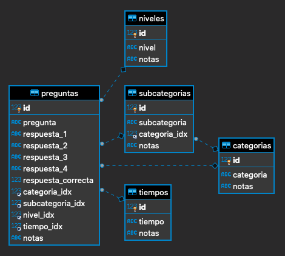

# Trivial Musical
Trivial Musical for educational purposes (see license)

### Contact
If you need to know more about this repo, its licensing posibilities or any other aspect, please, 
get in touch with  [Marcial Ruiz Escudero](mailto:#@#)

## Database model


## Dot-env (.env) example file
In order to rule out the application behavior you need to use environment variables. In devel time
you can use a '.env' file locally. In run time, if you are using containers, you need to use
environment variables injected upon container instantiation. 

```
export DEV_SK = 'LONG_STRING_HERE'
export DEV_DB = 'HOST=localhost,USER=user,PASS=pass,DATABASE=db_name'

export TST_SK = 'LONG_STRING_HERE'
export TST_DB = 'HOST=test_server,USER=user,PASS=pass,DATABASE=db_name'

export PRD_SK = 'LONG_STRING_HERE'
export PRD_DB = 'HOST=prod_server,USER=user,PASS=pass,DATABASE=db_name'

export MODE_CONFIG = 'Development'
```
